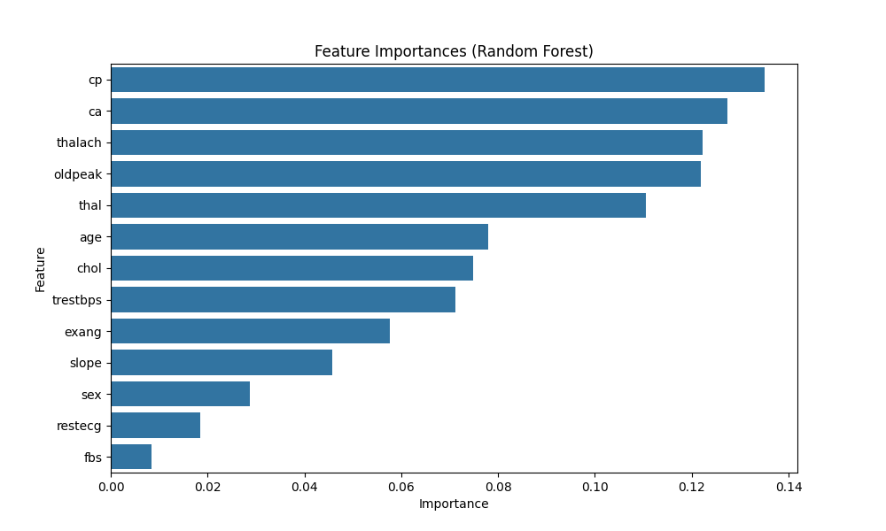

#                                                 Elevate Labs AI & ML Internship

# Task 5: Decision Trees and Random Forests

## Objective
Learn tree-based models for classification using the Heart Disease Dataset.

## Key Learnings
- Decision tree mechanics and overfitting control with depth limitation.
- Ensemble learning with Random Forest (bagging + random feature selection).
- Feature importance analysis and cross-validation for model evaluation.
  

## Dataset Info
- **Name:** Heart Disease Dataset
- **Source:** Downloaded from `https://www.kaggle.com/datasets/johnsmith88/heart-disease-dataset`
- Saved at: `data/input/heart_disease.csv`
- **Target:** target (1=disease, 0=no disease)

## Tools Used
- Python
- Pandas, NumPy
- Matplotlib, Seaborn
- Scikit-learn
- Graphviz

## Steps Completed
1. **Train Decision Tree**: Fitted with default settings and depth=3 (to control overfitting).
2. **Train Random Forest**: Used 100 trees for comparison.
3. **Feature Importances**: Analyzed and plotted for Random Forest.
4. **Cross-validation**: Evaluated both models with 5-fold CV.
5. **Compare Accuracy**: Compared Decision Tree vs. Random Forest performance.
6. **Note**: Decision Tree visualization was skipped due to Graphviz installation issues.

## Final Output
- Task Completed
  

## Output Files
- `data/output/train_data.csv`: Training set with features and target.
- `data/output/test_data.csv`: Test set with features and target.

## Output Visualizations
- Feature Importance (Random Forest):
  
  
  

## Folder Structure

## Challenges and Code Adjustments
- **Missing Dataset File**: Added a file existence check with `os.path.exists()` and printed an error message to guide file placement. Updated `data_path` to match the correct location after downloading.
- **Graphviz Visualization**: Removed Graphviz-related code (`export_graphviz` and `graphviz.Source`) to proceed without visualization, focusing on accuracy, feature importances, and cross-validation.

## Code Adjustments for GitHub
- dataset_path = r'data/input/breast_cancer.csv'
- visuals_dir = 'visuals'
- confusion_matrix_path = f'{visuals}/confusion_matrix.png'
- roc_curve_path = f'{visuals}/roc_curve.png'
- sigmoid_curve_path = f'{visuals}/sigmoid_curve.png'
- output_dir = 'data/output'
- train_data_path = f'{output_dir}/train_data.csv'
- test_data_path = f'{output_dir}/train_data.csv'

## Submission
- GitHub Repository: https://github.com/Shalvi-Surve/Elevate_Labs_task5
